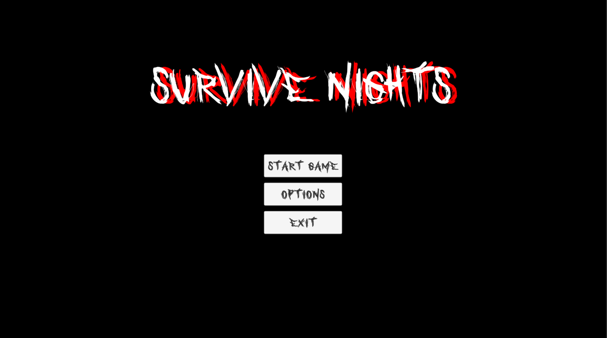
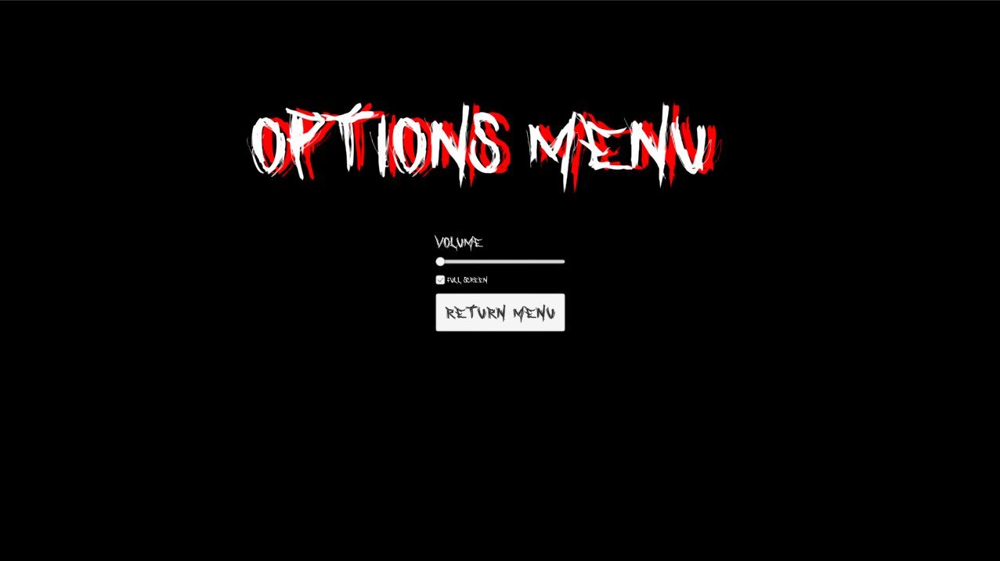
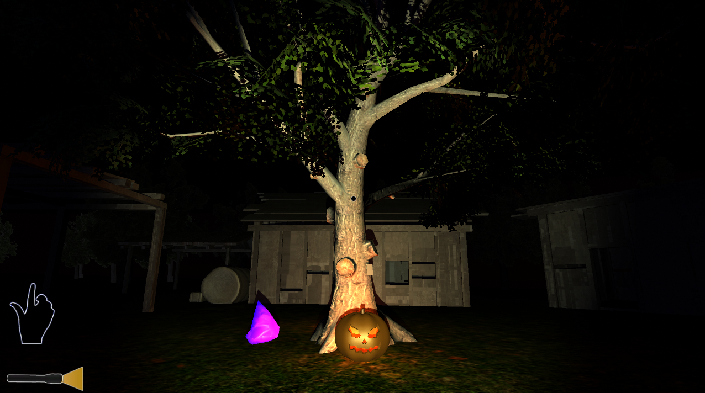
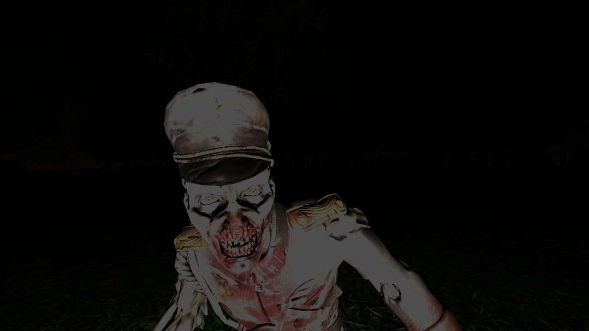
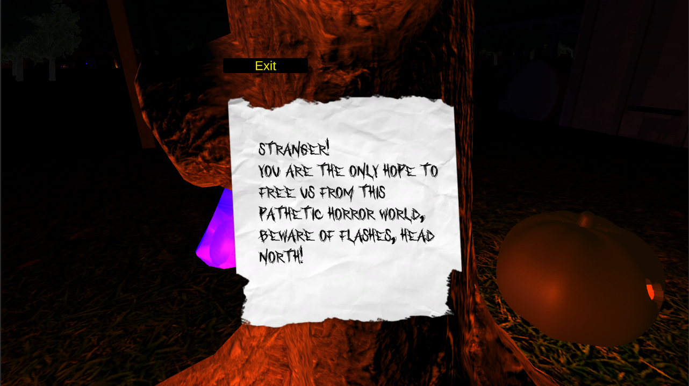
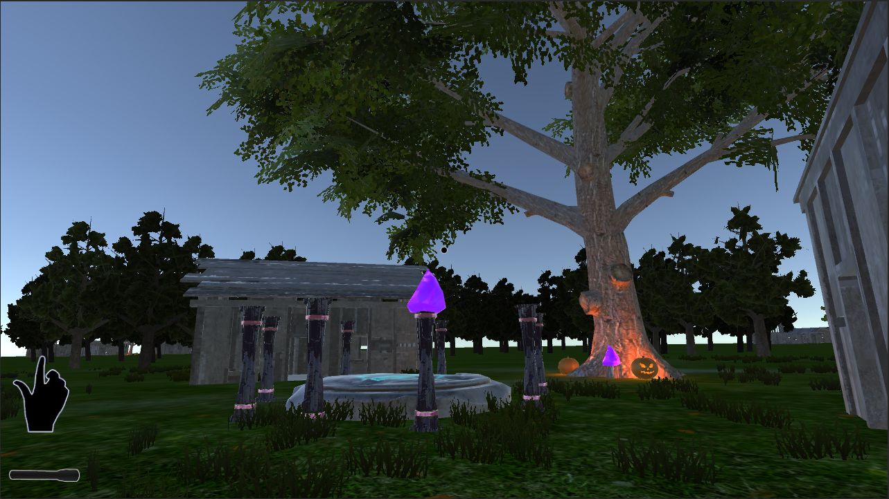
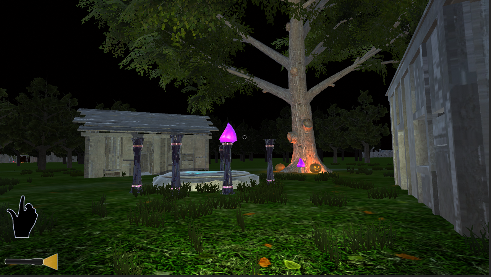
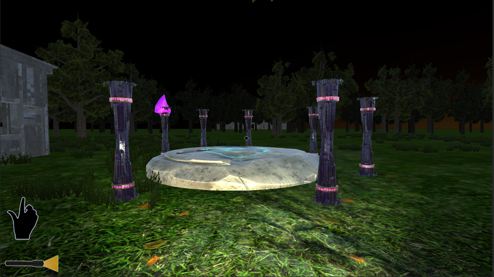

# Survive Nights
A Horror Based Survival Game created using Unity Game Engine (Editor Version: 2021.3.6f1). As the name tells the player has to survive the horror in the forest and try to escape through portal, where he needs to collect crystal through different villages, and the player should fight against the zombies and not get afraid of jump scares before the day light starts to come, later the player realises he himself was a zombie and had little awareness. Can you make him survive through the night and escape? 🤓

## Player Control Actions

|Controls|Action  |
|--|--|
|W  |Move Forward  |
|A  |Move Left  |
|S  |Move Backward  |
|D  |Move Right  |
|E  |Interaction   |
|F  |Flashlight ON/OFF   |
|Space  |Jump  |
|Esc  |Pause  |
|1  |Use Hand  |
|2  |Use Knife  |
|3  |Use Pistol  |
|4  |Use M4  |
|Mouse Move |Player Angle changes  |
|Mouse Left Click  |Fire  |
|Mouse Right Click  |Reload  |

## Screenshots

### Intro Menu

### Option Menu

### Village 1

### Zombie Jump Scare

### Note System

### Portal Village (Day)

### Portal Village (Night)

### Portal

## Contributers
So, we developed this as our course FAVR(UE20CS315) Project to learn more about Unity and also for marks 😂
Thanks to [**Hemanth Reddy N**](https://github.com/hemanth-2104) for helping me in the project!

### Note
This game still needs to be developed, we have just implemented basic working of the game. Thank you!
